# Hamza Khan

<a href="https://Khanx_Hamza.dev"></a>

[**Portfolio**](https://Khanx_Hamza.dev) · [**LinkedIn**](https://www.linkedin.com/in/hamza-khan-tech) · [**Email**](mailto:hamzakhan.cs25@gmail.com?subject=Hello%20Hamza) · [**Resume (PDF)**](assets/Hamza_Khan_CV.pdf)

<table>
<tr>
<td></td>
<td></td>
<td></td>
<td></td>
</tr>
</table>

[About](#about) · [AI pipeline](#how-i-build-ai-features) · [Projects](#featured-projects) · [Experience](#experience) · [Skills](#skill-ecosystem) · [Activity](#github-activity) · [Contact](#lets-talk)

## About

I am a full-stack developer who owns features end to end, from schema and API design to interface. I build with React, Next.js, TypeScript and Node.js, then add AI-integrated features such as RAG pipelines, semantic search and LLM assistants.

<b>Recruiter quick facts</b>

| | |
|---|---|
| Role | Full-Stack Software Developer (React, Next.js, TypeScript, Node.js) |
| Specialty | AI integration: RAG, semantic search, LLM assistants |
| Location | Islamabad, Pakistan |
| Current | Full-Stack Developer Intern, Mehdi Technologies (Aug 2026 - present) |
| Education | BS Computer Science, University of Swabi, 2022-2026 |
| Links | [Portfolio](https://Khanx_Hamza.dev), [LinkedIn](https://www.linkedin.com/in/hamza-khan-tech), [Email](mailto:hamzakhan.cs25@gmail.com), [Resume](assets/Hamza_Khan_CV.pdf) |

## How I build AI features

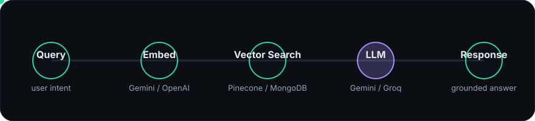

I turn a user query into an embedding, retrieve the most relevant context, and pass grounded context to an LLM. TaskConnect uses semantic search with MongoDB Vector Search; Part Plumbing uses a RAG support assistant with Gemini, Pinecone and Groq.

## Featured projects

<table>
<tr>
<td width="50%" valign="top"><a href="https://tasker-app-hazel.vercel.app/">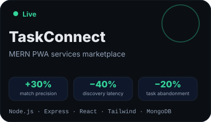</a></td>
<td width="50%" valign="top"><a href="https://parts-plumbing.vercel.app/">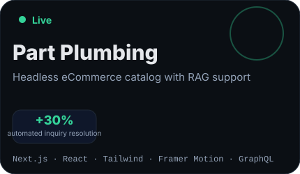</a></td>
</tr>
<tr>
<td width="50%" valign="top"><a href="https://chat-bot-beige-chi.vercel.app/">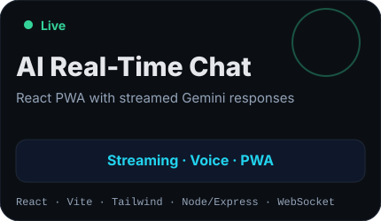</a></td>
<td width="50%" valign="top"><a href="https://profileiq.dev">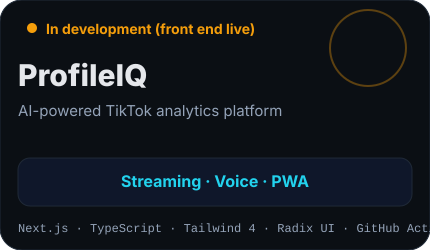</a></td>
</tr>
</table>

<b>TaskConnect</b>: architecture, highlights, links

MERN PWA services marketplace and final-year project with geospatial matching, JWT + RBAC, Dockerized REST APIs, Gemini semantic search with MongoDB Vector Search, and an LLM listing assistant.

- Metrics: +30% match precision · -40% discovery latency · -20% task abandonment
- Stack: Node.js, Express, React, Tailwind, MongoDB, Stripe, Firebase FCM, Google Maps, Docker, Jest, Cypress, Gemini
- [Live Demo](https://tasker-app-hazel.vercel.app/) · [Code](https://github.com/TaskConnect-Team/Tasker)

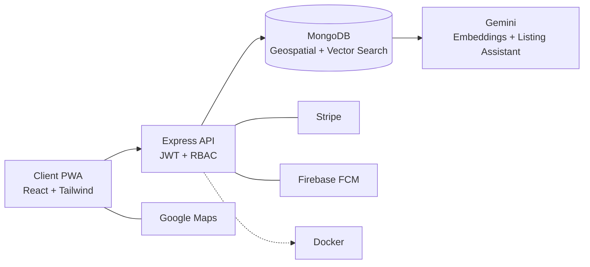

<b>Part Plumbing</b>: architecture, highlights, links

Headless eCommerce catalog built with Next.js and WordPress/WooCommerce via GraphQL, with ISR, debounced filtering, WhatsApp inquiry flows, and a RAG support assistant.

- Metric: +30% automated inquiry resolution
- Stack: Next.js, React, Tailwind, Framer Motion, GraphQL, Supabase, Pinecone, Gemini, Groq
- [Live Demo](https://parts-plumbing.vercel.app/) · [Code](https://github.com/hamzakhan-std25/Parts-Plumbing)

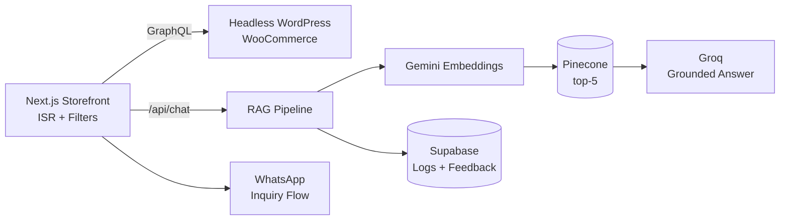

<b>AI Real-Time Chat</b>: architecture, highlights, links

React + Vite PWA with a Node/Express WebSocket backend, streamed Gemini responses with cancel, voice messages, Firebase authentication, Supabase sessions, an offline fallback page, and Docker. RAG is planned, not built.

- Features: Streaming · Voice · PWA
- Stack: React, Vite, Tailwind, Node/Express, WebSocket, Gemini, Firebase Auth, Supabase, Docker
- [Live Demo](https://chat-bot-beige-chi.vercel.app/) · [Code](https://github.com/hamzakhan-std25/chat-interface-react-tailwind)

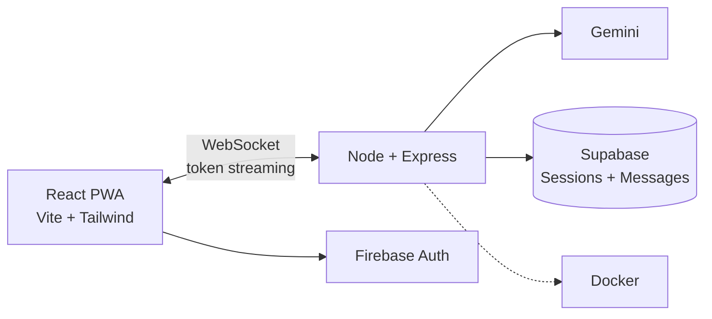

<b>ProfileIQ</b>: architecture, status, link

AI-powered TikTok analytics platform. The front end is live; TikTok connection and AI insights are in development.

- Status: In development (front end live)
- Stack: Next.js, TypeScript, Tailwind 4, Radix UI, contact route handler, GitHub Actions CI
- [Live Demo](https://profileiq.dev)

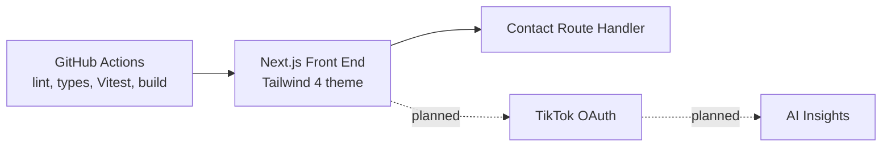

## Experience


### Full-Stack Developer Intern · Mehdi Technologies
`Islamabad` · Aug 2026 - present

- Shopify storefronts and apps with React, Node.js and REST APIs
- Built a Shopify quiz app with automated discount fulfillment using React, Node.js, REST and Supabase
- Real-time Node.js services with WebSockets, Redis, Prisma and Supabase
- Git/GitHub code reviews while extending Shopify through custom apps

### React Developer Intern · Internee.pk
`Remote` · Jul 2025 - Sep 2025

- Reusable React/Next.js interfaces and REST integrations
- Code-splitting and lazy loading to cut initial asset delivery
- Responsive UI with Tailwind CSS; Git/GitHub, code reviews and Agile

### Web Developer Intern · TechCreator
`Swabi` · Mar-Jun 2025 and Sep-Dec 2025

- WordPress/WooCommerce sites, payment gateways, forms, staging, migrations and launches
- Caching and image optimization; SEO with Yoast

## Skill ecosystem

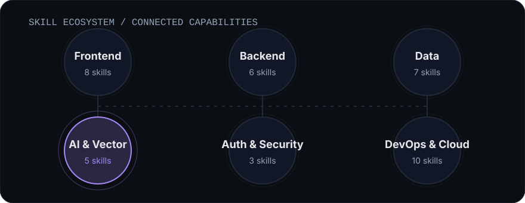

| Area | Skills |
|---|---|
| Frontend | React.js, Next.js, TypeScript, JavaScript (ES6+), Tailwind CSS, Framer Motion, Shadcn UI, Redux Toolkit |
| Backend | Node.js, Express.js, REST APIs, WebSockets, GraphQL, API Integration |
| Data | MongoDB, PostgreSQL, MySQL, Supabase, Pinecone, Prisma, Redis |
| AI & Vector | RAG, LLM Integration (Gemini, OpenAI, Groq), Semantic Search, AI Chatbots, MongoDB Vector Search |
| Auth & Security | JWT, OAuth 2.0, Role-Based Access Control |
| DevOps & Cloud | Git, GitHub, Docker, Firebase, CI/CD, Vercel, Jest, Cypress, Postman, Linux |

## GitHub activity

<picture>
  <source media="(prefers-color-scheme: dark)" srcset="https://raw.githubusercontent.com/hamzakhan-std25/hamzakhan-std25/output/github-contribution-grid-snake-dark.svg">
  <source media="(prefers-color-scheme: light)" srcset="https://raw.githubusercontent.com/hamzakhan-std25/hamzakhan-std25/output/github-contribution-grid-snake.svg">
  
</picture>

## Education & certifications

**BS Computer Science** · University of Swabi, Khyber Pakhtunkhwa · 2022-2026 · GPA 3.45/4.0

Google IT Support Professional Certificate · IBM DevOps & Software Engineering · Google Project Management Professional Certificate · HCCDA-AI (in progress)

## Let's talk

[Portfolio](https://Khanx_Hamza.dev) · [LinkedIn](https://www.linkedin.com/in/hamza-khan-tech) · [Email Hamza](mailto:hamzakhan.cs25@gmail.com?subject=Hello%20Hamza)
