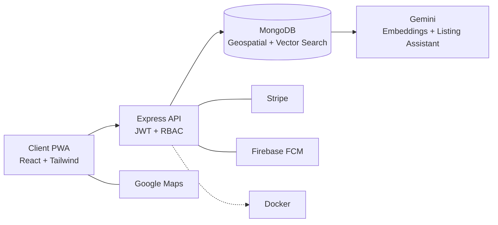
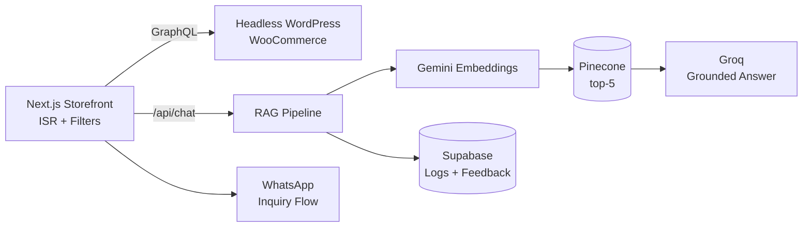
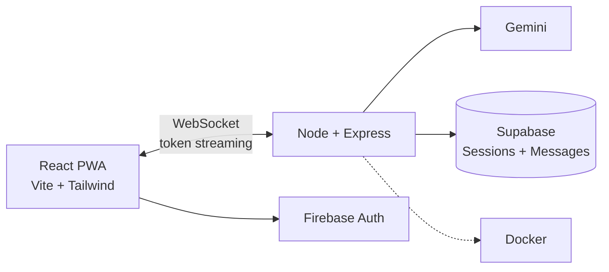
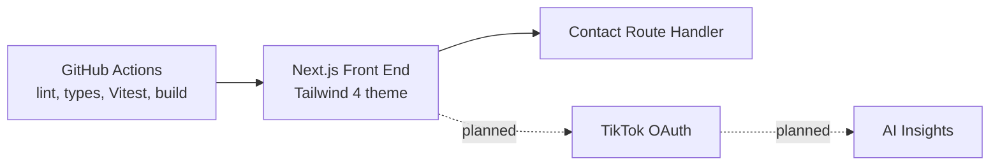

# GitHub Profile README: Architecture & Agent Runbook

Target repo: `hamzakhan-std25/hamzakhan-std25` (renders at github.com/hamzakhan-std25)
Place this file at `docs/ARCHITECTURE.md` in that repo. It is the single source of truth for the Copilot agent.

The agent cannot see the portfolio repo or the resume, so **everything it needs is in this file**
(facts in Section 10, design in Sections 3–8, execution in Sections 9 and 11).

---

## 1. Goals and non-goals

**Goal:** a profile that looks designed, not templated, and proves the claims on the resume:
full-stack depth, AI integration (RAG, semantic search, LLM), shipped projects, real experience.

| Goal | How it is measured |
|---|---|
| Strong first impression in 5 seconds | Animated hero + role line + 3 proof points visible without scrolling |
| Recruiter can decide in 30 seconds | Featured projects with metrics, Live Demo and Code links, resume link |
| Engineer can verify in 2 minutes | Architecture diagrams per project, real repos, live CI/metrics |
| Looks alive | Animated SVGs, auto-updating stats, contribution snake |
| Fast, robust, accessible | No third-party image host above the fold, alt text everywhere, readable with images off |

**Non-goals:** hit counters, badge walls (more than ~12 badges), fake statistics, trophies/streak widgets
hosted on free Vercel instances (they rate-limit and break), autoplay audio, anything needing JavaScript.

---

## 2. What GitHub can and cannot do (hard constraints)

GitHub sanitizes README HTML. Design within this table. Do not try to work around it.

| Capability | Status | Use it for |
|---|---|---|
| `<script>`, `<iframe>`, `<style>`, inline `style=""`, custom CSS | Blocked | Never use |
| Clickable images `<a></a>` | Works | Project cards, CTA banners |
| `<details><summary>` | Works | "Interactive" expand/collapse sections |
| Mermaid fenced blocks (```` ```mermaid ````) | Works (also inside `<details>`) | Architecture diagrams |
| Animated SVG via `` | Works: CSS `@keyframes` and SMIL (`<animate>`, `<animateMotion>`) inside the SVG | Hero, pipeline, timeline |
| SVG `<script>`, external fonts/images/CSS inside the SVG | Blocked | Use system font stacks, embed shapes, no `@import` |
| `<picture>` with `prefers-color-scheme` sources | Works | Only if a light variant is needed |
| Relative paths (`assets/hero.svg`) | Works in a profile README | All local assets |
| Third-party images | Proxied through camo, cached, may rate-limit | Below the fold only, with fallback |
| Tables, `align`, `width`, `<kbd>`, `<sub>`, emoji | Works | Layout |
| Buttons that run code | Impossible | Use links, `mailto:` with prefilled subject |

"Interactive" on GitHub therefore means: **clickable cards, expandable sections, rendered diagrams,
animated graphics, live-updating generated stats.** Build exactly those.

### Mobile legibility rule (important)
The README column is about 880px wide on desktop and scales down on phones (about 0.4× at 375px).
Text inside an SVG shrinks with it. Therefore:
- SVG text is for **big labels only**: name ≥ 56px, roles ≥ 28px, card titles ≥ 30px, metrics ≥ 40px (at an 880-wide viewBox).
- **All detail text lives in real Markdown** under the SVG, where GitHub reflows it.
- Use `viewBox="0 0 880 H"` with `width="100%"` so every asset scales uniformly.

---

## 3. Presentation strategy

### 3.1 Audiences
| Audience | Wants | Served by |
|---|---|---|
| Recruiter / hiring manager | Role fit, recency, proof | Hero, TL;DR block, project cards with metrics, resume link |
| Engineering lead | Depth, how it was built | Architecture diagrams, repos, CI, metrics SVG |
| Client / collaborator | Can you ship, how to reach you | Live demos, portfolio link, contact CTA |

### 3.2 Attention tiers (the page is built in this order)
1. **0–5s:** hero banner (name, rotating roles, "Open to opportunities"), links row, 3 proof chips.
2. **5–30s:** one-paragraph summary, pipeline graphic (signature visual), four project cards.
3. **30s–2min:** expandable architecture per project, experience timeline, skill ecosystem.
4. **Bonus:** live GitHub metrics, contribution snake, education, contact CTA.

### 3.3 Narrative
"Full-stack developer who ships real apps, then adds the AI layer." Every section reinforces that:
web apps → AI features → measurable outcomes → how to reach me. Claims are always backed by a link
(demo, repo or diagram). If something is planned or unfinished, say so plainly (for example ProfileIQ).

### 3.4 Tone
First person, plain and confident, short sentences. No buzzword stacks, no "passionate about".

### 3.5 Never include
Phone number, fabricated stats, testimonials, "10K+ users" style claims, hit counters,
more than ~12 badges, employers or repos not listed in Section 10.

---

## 4. Visual design system

Match the portfolio (dark, teal/emerald to cyan accent on near-black). Confirm exact hex from the portfolio's
`globals.css` if available; otherwise use:

| Token | Value | Use |
|---|---|---|
| `--bg` | `#0B0F14` | SVG background |
| `--panel` | `#111827` | Cards |
| `--panel-2` | `#0F172A` | Inner panels |
| `--border` | `#1F2937` | Card outlines |
| `--accent-1` | `#34D399` | Emerald, primary accent |
| `--accent-2` | `#22D3EE` | Cyan, secondary accent |
| `--accent-3` | `#A78BFA` | Violet, AI/RAG highlight |
| `--text` | `#E5E7EB` | Primary text |
| `--muted` | `#94A3B8` | Secondary text |
| `--warn` | `#F59E0B` | "In development" badge |

Typography (system fonts only, since SVG-in-img cannot load web fonts):
- Sans: `'Segoe UI', Inter, system-ui, -apple-system, Roboto, Helvetica, Arial, sans-serif`
- Mono: `'SFMono-Regular', Consolas, 'Liberation Mono', Menlo, monospace`

Rules:
- Every SVG draws its **own background rounded rect**, so it looks right in GitHub light and dark themes.
- Gradient: `linear-gradient(135deg, accent-1 → accent-2)`. Glow: Gaussian blur on small shapes only (keep files light).
- Corner radius 16–24. Generous padding. One idea per graphic.
- Each SVG: `<title>` and `<desc>` for accessibility, `role="img"`, under 40 KB, total assets under 400 KB.
- Motion is subtle and looping (4–12s cycles). Include this in every animated SVG:

```css
@media (prefers-reduced-motion: reduce) { * { animation: none !important; } }
```
(SMIL `<animate>` cannot be disabled by CSS, so keep SMIL only in the pipeline graphic and keep it slow.)

---

## 5. Asset inventory (what gets built)

All generated by one zero-dependency Node script from `data/profile.json` (see Section 7).

| File | Size (viewBox) | Content | Motion |
|---|---|---|---|
| `assets/hero.svg` | 880×320 | Name, rotating roles (Full-Stack Developer / AI Integrator / RAG Builder), one-line value prop, "Open to opportunities" pill, 3 proof chips (4 Projects · 3 Internships · BS CS 2026), drifting gradient orbs and a faint dot grid | Role text crossfade (CSS, 9s loop), orb drift, pill pulse |
| `assets/pipeline.svg` | 880×200 | Query → Embed → Vector Search → LLM → Response, with sublabels (Gemini/OpenAI · Pinecone/MongoDB Vector Search · Gemini/Groq) | Glowing packet travels the path (`animateMotion`), nodes light in sequence |
| `assets/projects/taskconnect.svg` | 430×250 | Title, tagline (short), 3 metric chips (+30% / −40% / −20%), stack mini-row, "Live" dot | Subtle radar sweep behind title |
| `assets/projects/part-plumbing.svg` | 430×250 | Title, tagline, metric chip (+30% auto-resolution), RAG mini-flow icon row | Flow dots moving |
| `assets/projects/ai-chat.svg` | 430×250 | Title, tagline, "Streaming · Voice · PWA" chips | Typing-dots loop |
| `assets/projects/profileiq.svg` | 430×250 | Title, tagline, amber "In development" badge, green "Front end live" dot | Gentle shimmer |
| `assets/experience.svg` | 880×360 | Vertical timeline, 3 roles, newest first, current role highlighted | Line draws in, node pulses |
| `assets/skills.svg` | 880×340 | Six skill groups as connected clusters (Frontend, Backend, Data, AI & Vector, Auth, DevOps), AI cluster accented violet | Slow orbit/pulse |
| `assets/divider.svg` | 880×24 | Thin gradient line with moving highlight | Sweep |
| `assets/cta.svg` | 880×180 | "Let's build something together", email and portfolio call to action | Glow pulse |
| `assets/generated/metrics.svg` | (Action output) | Live GitHub stats | Updated daily |
| existing snake on `output` branch | (existing workflow) | Contribution snake | Already animated; **do not break it** |

Card SVGs are wrapped in links to the Live Demo. Text beyond the big labels is real Markdown below each card.

---

## 6. README layout map (top to bottom)

| # | Section | Visual | Interactive element |
|---|---|---|---|
| 1 | Hero | `hero.svg` | Links row: Portfolio · LinkedIn · Email · Resume (PDF) |
| 2 | Quick nav | Text links | Anchor jumps to each section |
| 3 | Summary + "Right now" | Markdown | `<details>` "Recruiter quick facts" |
| 4 | How I build AI features | `pipeline.svg` + 3-line explanation | Clickable link to the Part Plumbing section |
| 5 | Featured projects | 2×2 table of clickable project cards | Per project `<details>`: overview, highlights, Mermaid architecture, stack badges, links |
| 6 | Experience | `experience.svg` + bulleted Markdown for accessibility | `<details>` per role with highlights |
| 7 | Skill ecosystem | `skills.svg` + grouped badges | `<details>` per group |
| 8 | GitHub activity | `generated/metrics.svg` + snake | Auto-updated |
| 9 | Education & certifications | Compact table | none |
| 10 | Contact | `cta.svg` | `mailto:` with prefilled subject, LinkedIn, Portfolio |

### README skeleton (agent: follow this structure exactly, fill from Section 10)

````markdown
<div align="center">

<a href="PORTFOLIO_URL"></a>

[**Portfolio**](PORTFOLIO_URL) · [**LinkedIn**](https://www.linkedin.com/in/hamza-khan-tech) · [**Email**](mailto:hamzakhan.cs25@gmail.com?subject=Hello%20Hamza) · [**Resume (PDF)**](assets/Hamza_Khan_CV.pdf)

<sub>[About](#about) · [AI pipeline](#how-i-build-ai-features) · [Projects](#featured-projects) · [Experience](#experience) · [Skills](#skill-ecosystem) · [Activity](#github-activity) · [Contact](#lets-talk)</sub>

</div>

## About

(2 to 3 sentences from the summary in Section 10.)

<details>
<summary><b>Recruiter quick facts</b></summary>

| | |
|---|---|
| Role | Full-Stack Software Developer (React, Next.js, TypeScript, Node.js) |
| Specialty | AI integration: RAG, semantic search, LLM assistants |
| Location | Islamabad, Pakistan |
| Current | Full-Stack Developer Intern, Mehdi Technologies (Aug 2026 – present) |
| Education | BS Computer Science, University of Swabi, 2022–2026 |
| Links | Portfolio, LinkedIn, Email, Resume |

</details>

## How I build AI features


(3 lines: what each stage does and where it is used: TaskConnect and Part Plumbing.)

## Featured projects

<table>
<tr>
<td width="50%" valign="top"><a href="DEMO_URL"></a></td>
<td width="50%" valign="top"><a href="DEMO_URL"></a></td>
</tr>
<tr>
<td width="50%" valign="top"><a href="DEMO_URL"></a></td>
<td width="50%" valign="top"><a href="DEMO_URL"></a></td>
</tr>
</table>

<details>
<summary><b>TaskConnect</b>: architecture, highlights, links</summary>

(overview, highlights, metrics, stack badges, `Live Demo` and `Code` links, Mermaid diagram from Section 8)

</details>

(repeat <details> for the other three)

## Experience
## Skill ecosystem
## GitHub activity
## Education & certifications
## Let's talk
````

Formatting rules: blank line after every `<details>`/`<summary>` and before closing tags (required for Markdown and
Mermaid to render inside). Use `&nbsp;` sparingly. Keep the README under about 300 lines.

---

## 7. Technical architecture of the repo

```
hamzakhan-std25/
├── README.md                      # final page (hand-written Markdown +  references)
├── data/
│   └── profile.json               # single source of truth (from Section 10)
├── scripts/
│   ├── build-assets.mjs           # data/profile.json -> assets/*.svg (Node built-ins only)
│   ├── lib/                       # tokens.mjs, svg.mjs (helpers), templates/*.mjs
│   └── validate.mjs               # XML well-formed, size budget, alt text, placeholder and secret scan
├── assets/
│   ├── Hamza_Khan_CV.pdf          # add manually (resume with the Internee.pk typo fixed)
│   ├── hero.svg pipeline.svg divider.svg cta.svg experience.svg skills.svg
│   ├── projects/*.svg
│   └── generated/metrics.svg      # written by the metrics workflow
├── .github/
│   ├── copilot-instructions.md    # Section 12
│   └── workflows/
│       ├── snake.yml              # EXISTING: keep untouched
│       ├── metrics.yml            # new: daily metrics SVG
│       └── validate.yml           # new: runs scripts/validate.mjs on PRs and pushes
├── docs/ARCHITECTURE.md           # this file
├── package.json                   # "type": "module"; scripts: build:assets, validate
└── LICENSE (optional)
```

### 7.1 Why generate SVGs from data
Text edits (a new project, a new metric) regenerate every graphic consistently, avoiding hand-edited SVG drift.
The script uses template literals and no dependencies, so it runs anywhere with Node 20+.

`package.json` scripts:
```json
{
  "type": "module",
  "scripts": {
    "build:assets": "node scripts/build-assets.mjs",
    "validate": "node scripts/validate.mjs"
  }
}
```

### 7.2 `data/profile.json` shape
```json
{
  "name": "", "roles": [], "valueProp": "", "links": { "portfolio": "", "linkedin": "", "email": "", "github": "", "resume": "assets/Hamza_Khan_CV.pdf" },
  "proofChips": [], "summary": "", "experience": [], "education": {}, "certifications": [],
  "skillGroups": [], "projects": [
    { "id": "", "title": "", "tagline": "", "status": "live|in-development", "statusNote": "",
      "demoUrl": "", "githubUrl": "", "metrics": [{ "value": "", "label": "" }], "stack": [], "highlights": [] }
  ]
}
```
Unknown values (for example the portfolio URL) are stored as `"TODO_PORTFOLIO_URL"`. **The agent must not guess them.**
`validate.mjs` fails on any remaining `TODO_`.

### 7.3 SVG generation contract (`scripts/lib/svg.mjs`)
- Every generated file starts with `<svg xmlns="http://www.w3.org/2000/svg" viewBox="0 0 W H" width="100%" role="img">`, then `<title>`, `<desc>`.
- Escape all text (`&`, `<`, `>`, quotes). Never interpolate raw data into attributes.
- One `<style>` block per SVG with CSS variables and keyframes. No external URLs anywhere (`href="http` is a validation failure, except the `xmlns`).
- Deterministic output (no timestamps or random values in static assets), so diffs stay clean.

Motion reference (hero role rotation, three roles, 9s loop):
```css
.role { opacity: 0; animation: roleFade 9s infinite; }
.role:nth-of-type(2) { animation-delay: 3s; }
.role:nth-of-type(3) { animation-delay: 6s; }
@keyframes roleFade { 0% {opacity:0; transform:translateY(8px)} 6%,30% {opacity:1; transform:none} 36%,100% {opacity:0} }
```
Pipeline packet reference:
```xml
<path id="flow" d="M80 100 H800" fill="none" stroke="url(#g)" stroke-width="3"/>
<circle r="7" fill="#34D399"><animateMotion dur="6s" repeatCount="indefinite"><mpath href="#flow"/></animateMotion></circle>
```

### 7.4 Live metrics workflow (`.github/workflows/metrics.yml`)
Use the `lowlighter/metrics` action (self-hosted output, no third-party image service at view time).
The agent must check the action's current README for input names before finalizing.

```yaml
name: Metrics
on:
  schedule: [{ cron: "0 3 * * *" }]
  workflow_dispatch:
permissions:
  contents: write
jobs:
  metrics:
    runs-on: ubuntu-latest
    steps:
      - uses: lowlighter/metrics@latest
        with:
          token: ${{ secrets.METRICS_TOKEN }}
          user: hamzakhan-std25
          filename: assets/generated/metrics.svg
          committer_message: "chore: update metrics [skip ci]"
          base: header, activity, community, repositories
          plugin_languages: yes
          plugin_languages_sections: most-used
          plugin_languages_details: percentage
          config_timezone: Asia/Karachi
```
`METRICS_TOKEN` is a personal access token stored as a repo secret. **Hamza creates it manually** (Section 13). Until it exists,
the README must still render fine: commit a placeholder `assets/generated/metrics.svg` and note it in the PR summary.

### 7.5 Validation workflow (`validate.yml`)
Triggers on push and pull request. Steps: checkout → setup-node 20 → `npm run validate`. `validate.mjs` checks:
1. Every `assets/**/*.svg` parses as XML (use a small regex/stack check or `node:util`; no deps) and contains `<title>`.
2. Each SVG under 40 KB; total under 400 KB.
3. No `<script`, no `http://`/`https://` inside SVGs other than the `xmlns`, no `@import`, no `foreignObject`.
4. README images all have non-empty `alt`; every `` relative path exists.
5. No string `TODO_`, no phone number (`+92`), no token-like strings (`ghp_`, `github_pat_`).
6. README under 350 lines.

---

## 8. Project content and Mermaid diagrams

Use the metrics exactly as written. Do not add numbers.

| Project | Status | Demo | Code | Metrics |
|---|---|---|---|---|
| TaskConnect | Live | https://tasker-app-hazel.vercel.app/ | https://github.com/TaskConnect-Team/Tasker | +30% match precision · −40% discovery latency · −20% task abandonment |
| Part Plumbing | Live | https://parts-plumbing.vercel.app/ | https://github.com/hamzakhan-std25/Parts-Plumbing | +30% automated inquiry resolution |
| AI Real-Time Chat | Live | https://chat-bot-beige-chi.vercel.app/ | https://github.com/hamzakhan-std25/chat-interface-react-tailwind | none |
| ProfileIQ | In development (front end live) | https://profileiq.dev | *(omit until repo URL confirmed)* | none |

Ready-to-paste Mermaid (inside each project's `<details>`):

````markdown

````

````markdown

````

````markdown

````

````markdown

````

For ProfileIQ always label planned parts as planned. Do not present AI analysis as shipped.

---

## 9. Execution plan for the Copilot agent (phases)

One phase per run. After each phase: report, stop, wait for "continue". Hamza commits.
All phases must keep `snake.yml` and the snake image reference working.

| Phase | Work | Acceptance |
|---|---|---|
| 0 | Read `docs/ARCHITECTURE.md`, existing `README.md`, `.github/workflows/*`. Write `docs/PROFILE_AUDIT.md`: what exists, what is reused, risks. **No source edits.** | Audit lists every existing external image URL and workflow |
| 1 | Add `.github/copilot-instructions.md` (Section 12), `package.json`, `data/profile.json` (Section 10 verbatim), folder scaffold | `npm run validate` exists (may fail on TODOs) |
| 2 | `scripts/lib/tokens.mjs`, `svg.mjs`, `build-assets.mjs`; build `hero.svg`, `divider.svg`, `cta.svg` | Files render, valid XML, sizes within budget |
| 3 | Build `pipeline.svg` and the four `projects/*.svg` | Metrics match Section 8 exactly |
| 4 | Build `experience.svg` and `skills.svg` | Text matches data; current role highlighted |
| 5 | Write `README.md` from the skeleton, with Mermaid diagrams and `<details>` blocks; keep snake; replace the old vercel activity graph with `assets/generated/metrics.svg` | README under 350 lines; no TODO except the marked placeholders |
| 6 | Add `metrics.yml`, `validate.yml`, `scripts/validate.mjs`; run validate and fix | Validate passes except listed manual placeholders |
| 7 | Polish: alt text, anchor links, small-screen legibility review, file sizes, a checklist of manual visual checks | Report with sizes and the manual checklist |

---

## 10. Source of truth: facts (do not add anything not listed here)

**Identity**
- Name: Hamza Khan · Title: Full-Stack Software Developer
- Roles (rotating): Full-Stack Developer, AI Integrator, RAG Builder
- Location: Islamabad, Pakistan · Email: hamzakhan.cs25@gmail.com
- GitHub: https://github.com/hamzakhan-std25 · LinkedIn: https://www.linkedin.com/in/hamza-khan-tech
- Portfolio: `TODO_PORTFOLIO_URL` (Hamza supplies; the old `hamzakhan-std25.github.io/Portfolio-html-css` is obsolete, do not use)
- Resume: `assets/Hamza_Khan_CV.pdf` (Hamza adds the file)
- Phone: exists, **never display**

**Value prop:** "I build fast, production-ready web apps with React, Next.js and Node.js, and I add the AI layer, from semantic search to RAG support bots, that makes them smarter."

**Summary:** Full-stack developer who owns features end to end, from schema and API design to interface. Core stack: React, Next.js, TypeScript, Node.js with MongoDB, PostgreSQL and Supabase. Specializes in AI-integrated features: RAG pipelines, semantic search, LLM assistants. Has shipped web apps, real-time systems and eCommerce platforms.

**Proof chips:** 4 Projects · 3 Internships · BS Computer Science 2026

**Experience (newest first)**
1. Full-Stack Developer Intern, Mehdi Technologies, Islamabad, Aug 2026 – present
   - Shopify storefronts and apps with React, Node.js, REST APIs
   - Built a Shopify quiz app (React, Node.js, REST, Supabase) with automated discount fulfillment
   - Real-time Node.js services with WebSockets, Redis, Prisma, Supabase
   - Git/GitHub code reviews while extending Shopify through custom apps
2. React Developer Intern, Internee.pk, Remote, Jul 2025 – Sep 2025
   - Reusable React/Next.js interfaces and REST integrations
   - Code-splitting and lazy loading to cut initial asset delivery
   - Responsive UI with Tailwind CSS; Git/GitHub, code reviews, Agile
3. Web Developer Intern, TechCreator, Swabi, Mar–Jun 2025 and Sep–Dec 2025
   - WordPress/WooCommerce sites, payment gateways, forms, staging, migrations, launches
   - Caching and image optimization; SEO with Yoast

**Projects** (details, links and metrics in Section 8)
- TaskConnect: MERN PWA services marketplace (final-year project). Geospatial matching, JWT + RBAC, Dockerized REST APIs, Gemini semantic search with MongoDB Vector Search, LLM listing assistant. Stack: Node.js, Express, React, Tailwind, MongoDB, Stripe, Firebase FCM, Google Maps, Docker, Jest, Cypress, Gemini.
- Part Plumbing: headless eCommerce catalog, Next.js + WordPress/WooCommerce via GraphQL, ISR, RAG support assistant (Gemini embeddings, Pinecone top-5, Groq generation), Supabase chat logs and feedback, debounced filtering, WhatsApp inquiry flows, Vitest and Playwright tests. Stack: Next.js, React, Tailwind, Framer Motion, GraphQL, Supabase, Pinecone, Gemini, Groq.
- AI Real-Time Chat: React + Vite PWA, Node/Express WebSocket backend, streamed Gemini responses with cancel, voice messages, Firebase auth, Supabase sessions, offline fallback page, Docker. **RAG is planned, not built: do not claim it.**
- ProfileIQ: AI-powered TikTok analytics platform; front end live at profileiq.dev (Next.js, TypeScript, Tailwind 4, Radix UI, contact route handler, GitHub Actions CI with lint, type-check, Vitest, build). TikTok connection and AI insights are **in development**.

**Skills**
- Frontend: React.js, Next.js, TypeScript, JavaScript (ES6+), Tailwind CSS, Framer Motion, Shadcn UI, Redux Toolkit
- Backend: Node.js, Express.js, REST APIs, WebSockets, GraphQL, API Integration
- Data: MongoDB, PostgreSQL, MySQL, Supabase, Pinecone, Prisma, Redis
- AI & Vector: RAG, LLM Integration (Gemini, OpenAI, Groq), Semantic Search, AI Chatbots, MongoDB Vector Search
- Auth & Security: JWT, OAuth 2.0, Role-Based Access Control
- DevOps & Cloud: Git, GitHub, Docker, Firebase, CI/CD, Vercel, Jest, Cypress, Postman, Linux

**Education:** BS Computer Science, University of Swabi (Khyber Pakhtunkhwa), 2022–2026, GPA 3.45/4.0
**Certifications:** Google IT Support Professional Certificate · IBM DevOps & Software Engineering · Google Project Management Professional Certificate · HCCDA-AI (in progress)

**Open question for Hamza:** the old README mentions a "Kia Motors Metropolis" WordPress site. It is not on the resume. Do not include it unless Hamza confirms.

---

## 11. Master agent prompt

Hamza pastes this into Copilot Agent (Agent mode, repo `hamzakhan-std25/hamzakhan-std25` open). The same text is delivered in chat.

```markdown
## Role
You are a senior front-end/DevRel engineer building a high-visual, interactive GitHub profile README for Hamza Khan.

## Source of truth
Read docs/ARCHITECTURE.md completely before acting. It defines constraints, design system, asset list,
README skeleton, repo architecture, facts and phases. Also read the existing README.md and .github/workflows/*.
Facts in Section 10 are the only allowed content. Never invent metrics, employers, links, repos or claims.
If a value is missing, write TODO_<NAME> in data/profile.json and list it in your report.

## Execution rules
1. Run ONE phase at a time (Section 9), starting with Phase 0. After each phase STOP and report:
   files created/modified/deleted, commands run and results, placeholders left, anything unsure.
   Wait for me to reply "continue".
2. Respect GitHub's README limits (Section 2): no scripts, iframes, style attributes or external assets in SVGs.
   Every SVG is self-contained, has <title> and <desc>, uses system fonts, and stays under 40 KB.
3. SVGs carry big labels only; detail text lives in Markdown (mobile legibility rule).
4. Do NOT modify or delete .github/workflows/snake.yml or break the contribution-snake image reference.
5. Do not commit, push or create secrets. Never put tokens or the phone number in any file.
6. Do not add dependencies. Node 20 built-ins only.
7. After each phase run `npm run validate` (once it exists) and fix what you can; list what remains.
8. Keep the README under 350 lines, with alt text on every image and a readable structure with images disabled.

## Start now
Begin with Phase 0 only: produce docs/PROFILE_AUDIT.md without editing any source file.
```

---

## 12. `.github/copilot-instructions.md` (Phase 1 creates this file verbatim)

```markdown
# Rules: GitHub profile README project
- Source of truth: docs/ARCHITECTURE.md and data/profile.json. Never invent facts, metrics, links or employers.
- README is plain GitHub-flavored Markdown with safe HTML only. No scripts, iframes, style attributes.
- SVGs are generated by scripts/build-assets.mjs from data/profile.json. Edit the data or templates, not generated files.
- SVG rules: self-contained, viewBox width 880 (cards 430), <title>+<desc>, system font stacks, no external URLs,
  under 40 KB each, motion via CSS keyframes or SMIL, include a prefers-reduced-motion block.
- Big text in SVGs, detail text in Markdown.
- Never touch .github/workflows/snake.yml. Never commit secrets. Never display the phone number.
- Node 20 built-ins only. Run `npm run validate` before finishing and list files touched.
- One phase per task. Stop and report.
```

---

## 13. Manual steps for Hamza (the agent cannot do these)

1. Put the resume PDF at `assets/Hamza_Khan_CV.pdf` (fix "Internee.pks" to "Internee.pk").
2. Give the agent the portfolio URL (replaces `TODO_PORTFOLIO_URL`).
3. Confirm the ProfileIQ repo URL and whether it is public.
4. Create a fine-grained or classic personal access token for metrics, add it as repo secret `METRICS_TOKEN`
   (read-only scopes; include `read:org` if you want the `TaskConnect-Team` repos counted). Never paste it into files.
5. Preview the README on a branch (`github.com/hamzakhan-std25/hamzakhan-std25/blob/<branch>/README.md`), then merge to `main`
   (a profile README only shows from the default branch).
6. Fix the placeholders in the Parts-Plumbing repo README ("Your Name", `your-username`, demo URL); recruiters click through.
7. Clean the live ProfileIQ site (remove or label the sample stats and testimonials) before featuring it.
8. After the first metrics run, open the workflow logs to confirm it committed `assets/generated/metrics.svg`.

---

## 14. Manual QA checklist (after Phase 7)

- [ ] Hero renders and animates on desktop, in the GitHub mobile view (375px) and in dark and light themes.
- [ ] Hero text is legible at 375px; no card text smaller than readable.
- [ ] Every card links to the correct demo; Code buttons only where a repo exists.
- [ ] Each `<details>` opens and the Mermaid diagram renders inside it.
- [ ] Metrics on cards match Section 8 exactly; ProfileIQ shows "In development".
- [ ] Snake still loads; metrics SVG loads (placeholder or generated).
- [ ] Page is understandable with images disabled.
- [ ] `npm run validate` passes; total SVG weight under 400 KB.
- [ ] No phone number, no token-like strings, no `TODO_` left.
- [ ] Browser cache check: hard refresh after updating SVGs (GitHub's image proxy caches them for a while).